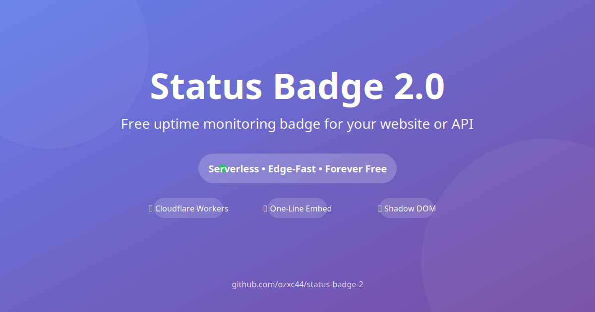

# Social Preview Image Instructions

GitHub social previews appear when your repo is shared on Twitter, LinkedIn, etc.

## Requirements

- Size: 1200×630 pixels (1.91:1 ratio)
- Format: PNG or JPG
- File size: Under 1MB

## Design

### Text to Include

```
Status Badge 2.0
Free Forever Status Monitoring
On Cloudflare Workers
```

### Visual Elements

1. **Background**: Cloudflare orange (#F48120) gradient
2. **Badge Preview**: Show an actual badge (Online • 45ms • 99.9%)
3. **GitHub Icon**: Include GitHub octocat or stars icon
4. **Free Badge**: "Free Forever" prominently displayed

## Creation Options

### Option 1: HTML to Image (Recommended)

```html
<!-- Save as preview.html and open in browser -->
<html>
<head>
  <style>
    body {
      width: 1200px;
      height: 630px;
      background: linear-gradient(135deg, #F48120 0%, #FF6B35 100%);
      display: flex;
      align-items: center;
      justify-content: center;
      font-family: system-ui;
    }
    .card {
      background: white;
      padding: 60px;
      border-radius: 20px;
      text-align: center;
    }
    h1 { font-size: 48px; margin: 0; }
    .subtitle { font-size: 24px; color: #666; margin: 20px 0; }
    .badge {
      background: #f4f4f4;
      padding: 20px 40px;
      border-radius: 50px;
      font-size: 20px;
      display: inline-block;
      margin: 30px 0;
    }
    .free {
      background: #10B981;
      color: white;
      padding: 10px 30px;
      border-radius: 50px;
      display: inline-block;
      margin-top: 20px;
    }
  </style>
</head>
<body>
  <div class="card">
    <h1>Status Badge 2.0</h1>
    <p class="subtitle">Free Forever Status Monitoring on Cloudflare Workers</p>
    <div class="badge">● Online • 45ms • 99.9%</div>
    <div class="free">FREE FOREVER</div>
  </div>
</body>
</html>
```

Then screenshot at 1200×630.

### Option 2: Figma/Canva Template

1. Create 1200×630 canvas
2. Add gradient background
3. Add text elements
4. Export as PNG

### Option 3: CLI Tool

```bash
# Install
npm install -g capture-website-cli

# Generate
capture-website preview.html --width=1200 --height=630 --output=og-image.png
```

## After Creation

1. Save as `og-image.png` in repo root
2. Add to `_config.yml` (if using Jekyll):

```yaml
image: /og-image.png
```

3. Or add to README:

```html
<a href="https://github.com/ozxc44/status-badge-2">
  
</a>
```

## Verification

Test your preview at:
- https://cards-dev.twitter.com/validator
- https://www.linkedin.com/post-inspector/

Enter your repo URL and verify the image appears.
